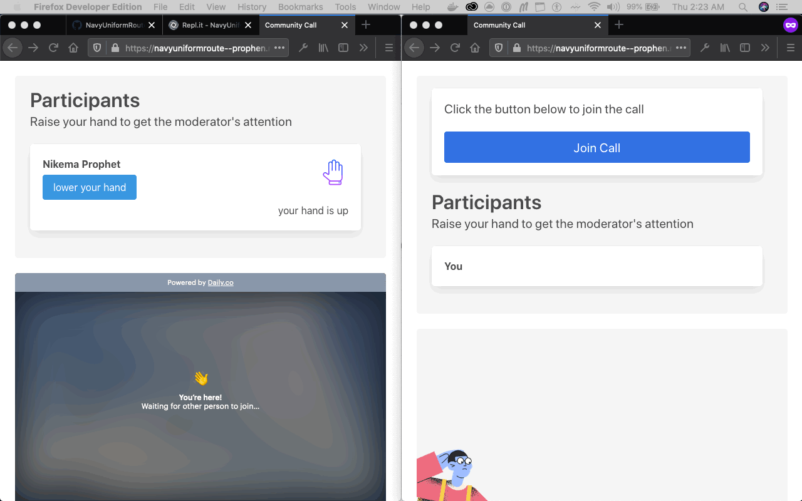

# Demo 
> The [full sample app source code](https://repl.it/@prophen/NavyUniformRoute) is viewable on repl.it

## Project links
- [Blog post](https://dev.to/nikema/build-a-daily-js-video-call-app-with-a-raise-your-hand-feature-4b2l-temp-slug-5157248?preview=d5a5ca6b27164656091bd89d6a831e2ba13ffb35bae17111f3f23219faf1f2176c037f5a931bed5a7a846b53e746817189aad0267180f46b7511bc6b)
- [Repl.it repl](https://repl.it/@prophen/NavyUniformRoute)
- [Hosted app](https://NavyUniformRoute--prophen.repl.co)
- [Getting Started Rewrite](https://github.com/prophen/NavyUniformRoute/blob/master/getting-started.md)
_____
- [GitHub repo](https://github.com/prophen/NavyUniformRoute)
- [Original Private Repo](https://github.com/prophen/developer-relations-engineer-project)

## For reference
- [Getting Started](https://docs.daily.co/docs/getting-started-1)
- [Daily.co API reference docs](https://docs.daily.co/reference)
